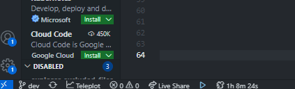

# Time Wasted On this Project

Are you working on a project for so long that you can't even remember?
How much time did you put in this project?

twop provides a minimalist and configurable time counter in the statusbar that pauses when you go idle and count when you're working hard!
🔥: Working, counting time.
🐿️: Idling,  counter stopped.

## Features

Status item:

Time wasted modal:

## Extension Settings

This extension contributes the following settings:

* `twop.idleTime`: (10) The amount of time in seconds before being considered idle and stopping the timer.
* Advanced settings
    * `twop.tickInterval`: (10000) The amount of time in milliseconds between each count tick.
    * `twop.saveInterval`: (1000) The amount of time in milliseconds between each save of the time.

## Release Notes

### 1.0.0

Initial release
