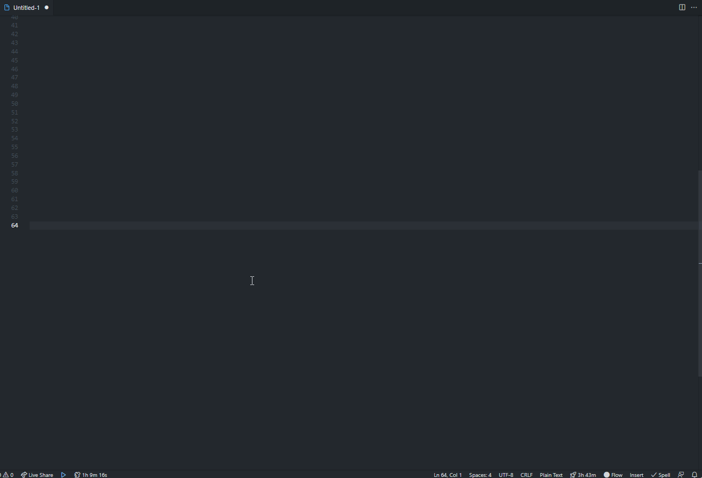

# Time Wasted On this Project

Are you working on a project for so long that you can't even remember?
How much time did you put in this project?

twop provides a minimalist and configurable time counter in the statusbar that pauses when you go idle and count when you're working hard!

🔥: Working, counting time.

🐿️: Idling,  counter stopped.

The status bar counter resets everyday but the total time spent is still visible in the overview.

If you click on the statusbar item a webview wil open with a list of all your projects and advanced stats.

> All the counters and informations are stored locally, no account is required

## Features

### Status item:

### Time wasted modal:

## Extension Settings

This extension contributes the following settings:

* `twop.idleTime`: (10) The amount of time in seconds before being considered idle and stopping the timer.
* Advanced settings
    * `twop.tickInterval`: (10000) The amount of time in milliseconds between each count tick.

## Release Notes

## [2.0.0]

- Bottom counter now resets everyday
- New counter system
    - fix huge counter increases if computer put in sleep mode between two ticks
    - Stored in a in-memory persistent local database
- Clicking on it opens the overview webview with
    - Project stats
    - Time spent working on that project
    - List of the other projects